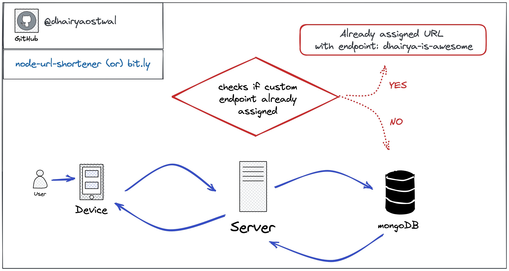

# node-url-shortener

<i>Built with :heart: in NodeJS</i>

[](https://documenter.getpostman.com/view/14800951/2s7Z12F3fE)
[](https://twitter.com/dhairyaostwal)

A simple URL Shortner REST API that uses `shortid` npm package to generate short endpoints for your long URL. The User can also specify `custom_end_param` which is essentially a customised endpoint for their long URL.



## Features

1. URL Shorten - custom, default parameters
2. Paginated API
3. Sort by created date `created_at`

## Technologies Used

1. NodeJS
2. MongoDB Atlas
3. `NPM Package`: mongoose
4. `NPM Package`: express
5. `NPM Package`: shortid

## Steps to Run

```
1. clone the project
2. npm init
3. create .env file for your MONGO_URI
4. Run the server using - npm run start
```

## API Docs

Visit the API Docs [here](https://documenter.getpostman.com/view/14800951/2s7Z12F3fE)
